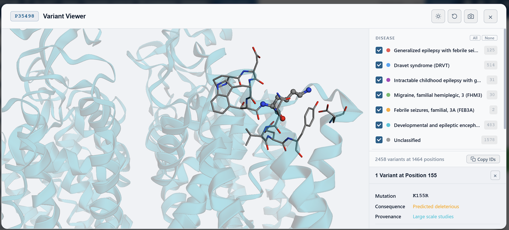

# 3D Feature Viewer for UniProt [](https://doi.org/10.5281/zenodo.21040422)

3D Feature Viewer for UniProt is a browser extension that brings structural protein interpretation directly into UniProt. It adds an interactive 3D workspace to UniProt entry pages so users can inspect post-translational modifications, variants, clinical annotations, precomputed variant-effect evidence, ligand context, and structural-context overlays without leaving UniProt.



## Features

- View UniProt PTMs, disease-associated variants, ClinVar annotations, and AlphaMissense scores on available 3D structures.
- Switch between AlphaFold models and mapped experimental PDB structures.
- Per-residue predictor table: EVE, ESM1b, FoldX ΔΔG, conservation, and CADD scores via ProtVar.
- Ligand and pocket context: PDBe-KB known sites, AlphaFill ligand context, PubChem/ChEMBL chemical links, and structure-based pocket inspection.
- Open Targets tractability and drug evidence per protein.
- Ligand similarity by CACTVS/Tanimoto fingerprint against AlphaFill transplants.
- Export residue sets and annotation data to CSV.

## Install

### Chrome

[Install from the Chrome Web Store](https://chromewebstore.google.com/detail/uniprot-3d-feature-viewer/fplpkbigppbpbcdmpkefdoilfgcicaof)

### Firefox

[Install from Mozilla Add-ons](https://addons.mozilla.org/en-US/firefox/addon/3d-feature-viewer-for-uniprot/)

<details>
<summary>Install manually from GitHub (latest build)</summary>

1. Go to the [Releases page](../../releases) and download the latest release:
   - `chrome-extension-v2.0.1.zip` for Chrome
   - `firefox-extension-v2.0.1.zip` for Firefox
2. Unzip the downloaded file.

**Chrome:**
1. Open `chrome://extensions/`
2. Enable **Developer mode** (top-right toggle)
3. Click **Load unpacked** and select the unzipped folder

**Firefox:**
1. Open `about:debugging#/runtime/this-firefox`
2. Click **Load Temporary Add-on**
3. Select the `manifest.json` inside the unzipped folder

> Firefox temporary add-ons are removed on browser restart.

**Build from source:**
```powershell
git clone https://github.com/aminkvh/3D-Feature-Viewer-for-UniProt.git
cd 3D-Feature-Viewer-for-UniProt
pwsh ./build-all.ps1
```

</details>

## Quick Start

1. Open any UniProt entry, e.g. `https://www.uniprot.org/uniprotkb/P14867/entry`
2. Go to a section with PTMs, variants, or related annotations.
3. Click **View in 3D**.
4. Choose a structure, filter annotations, click residues or the Nearby panel to inspect.
5. Export results via the Download menu.

## Documentation

See the [doc/](doc/) folder for a full guide to all features.

## Data and Privacy

The extension runs entirely in the browser with no server-side component. It retrieves data from public resources (UniProt, PDBe, AlphaFold DB, ProtVar, Open Targets, PubChem, AlphaFill). No personal data is collected. See [PRIVACY_POLICY.md](PRIVACY_POLICY.md) for details.

## License

Released under the MIT License. See [LICENSE](LICENSE).
